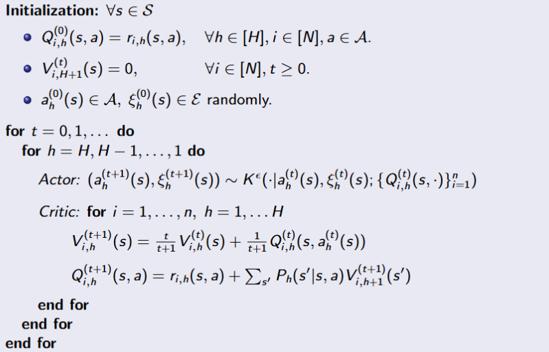
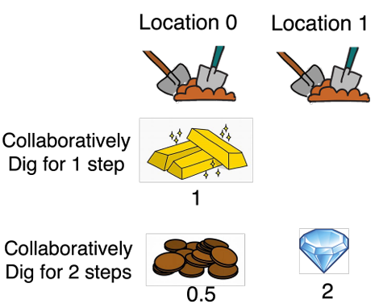
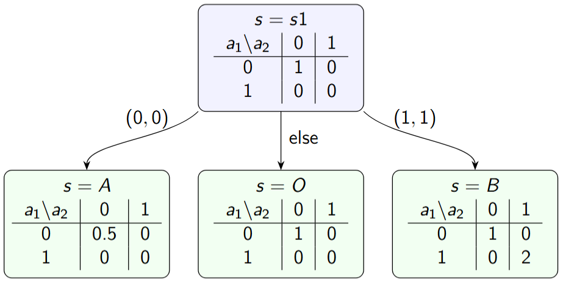
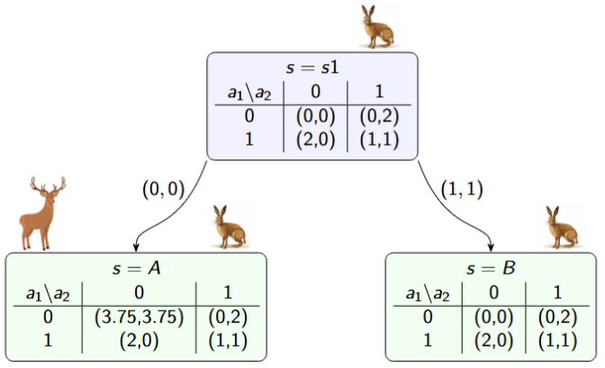

# Equilibrium Selection for Multi-agent Reinforcement Learning: A Unified Framework

This work implements what proposed in [Equilibrium Selection for Multi-agent Reinforcement Learning: A Unified Framework](https://arxiv.org/abs/2406.08844), written by Runyu Zhang, Jeff Shamma, Na Li. The paper addresses the problem of equilibrium selection in multi-agent reinforcement learning (MARL). 

While many MARL algorithms ensure convergence to some Nash equilibrium (NE), these equilibria can differ significantly in terms of rewards and social welfare. Building on insights from classical game theory, where decentralized learning can select potential-maximizing or Pareto-optimal NEs in normal-form games, we implement a unified framework for equilibrium selection in stochastic games. The framework is modular and adaptable, allowing established learning rules and selection results from normal-form games to be extended to the MARL setting.



We apply this framework to two normal-form games with two players and two stages $h = 1,2$, showing the convergence with two different learning rules.

## Learning Rules
For equilibrium selection, we assume that the group of agents follows certain iterative learning rules, which describe how they respond to the reward outcome from the previous action. In particular this is represented through a transition kernel $K^\epsilon$:

$$
(a^{(t+1)}, \xi^{(t+1)}) \sim K^\epsilon(\cdot,\cdot \mid a^{(t)},\xi^{(t)}),
$$
      
where $\xi \in \mathcal{E}$ are auxiliary variables, that depend on the rule, and $\epsilon \in (0,1)$ is a parameter that represents the ‘rate of mistakes’, assuming that agents does not respond in a fully rational and accurate way towards their observation of the reward outcome (rationality comes when $\epsilon \rightarrow 0$). 
     

### Log-linear Learning Rule
For this learning rule, there is no need for the auxiliary variables, $\mathcal{E} = \emptyset$. The kernel determines the new action as:

$$
K^\epsilon \left(a^{(t+1)} = (a_{-i}^{(t)},a_{i}^{(t+1)})\mid a^{(t)} ; \{r_i\}_{i=1}^n \right) = \frac{1}{n} \frac{\epsilon^{-r_i(a^{(t+1)})}}{\sum_{a'_i}{\epsilon^{-r_i(a'_i,a_{-i}^{(t)})}}}
$$

### Marden Mood Learning Rule
For this learning rule, the hidden variable $\xi$ takes the form $\xi = (\xi_1, \dots, \xi_n)$, where $\xi_i \in {C,D}$ represents the mood of agent *i* (C stands for Content, D for Discontent). The updating rule is the following.

*Action dynamics:* 

$$
\begin{cases}\text{if} \; \xi_i^{(t)} = D \rightarrow a_i^{(t+1)} \sim \text{Unif}(\mathcal{A}_i)\\ \\ \text{if} \; xi_i^{(t)} = C \rightarrow a_i^{(t+1)} \begin{cases}= a_i^{(t)} \quad\text{with prob} \; 1 - \epsilon^c\\ \sim \text{Unif}(\mathcal{A}_i\backslash \{a_i^{(t)}\}) \quad\text{with prob} \; \epsilon^c\end{cases} \end{cases}
$$

*Mood dynamics:*

$$
\begin{cases} \text{if} \; \xi_i^{(t)} = C \text{ and } a_i^{(t+1)} = a_i^{(t)} \rightarrow \xi_i^{(t+1)} = C \\ \\ \text{else} \rightarrow \xi_i^{(t+1)} = \begin{cases} C \quad\text{with prob} \; \epsilon^{1-r_i(a^{(t+1)})}\\ D \quad\text{otherwise} \end{cases} \end{cases}
$$


**Notice:** In the case of the Marden Mood learning rule, the term $\epsilon^{1-r_i(a^{(t+1)})}$ must be a valid probability. For this reason, the implementation takes care of the rewards normalisation. On the contrary, the Log-linear learning rule employs a softmax update, which inherently normalizes the rewards; applying normalization beforehand would result in an additional compression of the value range.

## Games

### Treasure Game

This identical interest game captures the process of two players collaboratively digging treasure at two different locations 0 and 1. Each location has a shallow level and a deep level, and it requires the players to collaboratively dig at the same location to make progress. 

- Location 0 has reward 1 at the shallow level and 0.5 at the deep level. 
- Location 1 has reward 0 at the shallow level and 2 at the deep level. 



The process can be summarized as a stochastic game. For h = 1, there’s only one state and thus the stage reward is given by a 2 by 2 reward matrix with nonzero reward of value 1 only when a = (0,0). The transition to the second stage follows the following transition rule: 
- if both players 1 and 2 choose to dig at location 0 ($a_1 = a_2 = 0$), then the game will transit to state $s = A$, where they can arrive at the deep level for location 0 and shallow level at location 1;
- if $a_1 = a_2 = 1$ then the game will transit to $s = B$, where they can arrive at the deep level for location 1 and shallow level at location 0;
- if the players fail to agree on a location, ($a = (0,1) or (1,0)$), they make no progress ($s = O$) and the reward will remain the same as stage $h = 1$.



In this game, there are two strict NEs:
1. agreeing twice on location 0, i.e. $a_{i,h} = 0$ for $h = 1,2$ and $i = 1,2$; 
2. agreeing twice on location 1, i.e. $a_{i,h} = 1$ for $h = 1,2$ and $i = 1,2$. 

Notice that the second NE is also the global optimal policy that gives a total reward 2, while the first only gives reward 1.5. 

We are going to show that for log-linear learning, the stochastically stable policy is the global optimal policy, thus it should converge to the second instead of the first NE.

### Stag Hunt game

This coordination game models the process of two players choosing whether to hunt a stag or a hare over two stages. Hunting the stag is harder, and thus requires both players to fully cooperate and to keep hunting persistently for two stages to success, but it has a high reward (7.5 allocated evenly to both players). Hunting the hare instead is easier and can be done individually with one stage, but also with lower payoff: the value is 2, eventually to be split if both players decide to catch the hare.

The process can be summarized as a stochastic game:



In this game, there are two strict Nash equilibria:

1. Stag NE: both players choose Stag at both stages ($a_{i,h} = 0$ for $h = 1,2$ and $i = 1,2$), yielding the Pareto-dominant outcome with total reward 7.5.
2. Hare NE: both players choose Hare at both stages ($a_{i,h} = 1$ for $h = 1,2$ and $i = 1,2$), yielding the risk-dominant outcome with total reward 2.

While the Stag equilibrium gives the higher social welfare, the Hare equilibrium is risk-dominant. We are going to show that running log-linear learning in this setting leads to convergence to the Hare equilibrium, while the Marden Mood learning rule favors the Pareto-optimal Stag equilibrium.

---

## Project Structure

```
.
├── img/                        # Images for documentation
├── notebooks/                  # Jupyter notebooks for experimentation
│   ├── Equilibrium_selection_MARL.ipynb # Reproduztion of paper's results
├── out/                        # Output directory for plots
├── src/                        # Source code for the project
│   ├── game.py                 # Games implementation
│   ├── learning_rule.py        # Learning rules implementation
│   ├── main.py                 # Entry point for running the experiments
│   ├── plot_utils.py           # Utility functions for generating plots
│   └── unified_learning.py     # MARL framework implementation
├── slides.pdf                  # Project presentation slides
├── requirements.txt            # List of required Python packages/dependencies
└── README.md                   # You're here!
```

---

## How to Run

### 1. Clone the Repo

```bash
git clone https://github.com/your-username/marl-equilibrium-selection
cd marl-equilibrium-selection
```

### 2. Set up Virtual Environment (Recommended)

```bash
python -m venv .env
source .env/bin/activate
```

### 3. Install Dependencies

```bash
pip install -r requirements.txt
```

### 4. Run the Default Example:

You can run experiments by executing

```bash
python src/main.py
```

and providing the following optional arguments:

* **`--iterations`** (int): total number of learning steps the simulation will run [default: 1000];
* **`--game`** (str): `"treasure"` or `"staghunt"` [default: ];
* **`--learning-rule`** (str):`"loglinear"` or `"mardenmood"` [default: `"loglinear"`];
* **`--rule-coeffs`** (float): parameters for the chosen learning rule [default: 0.01];
* **`--save`** (flag): if present, the generated plots will be saved to a file instead of being displayed on the screen [default: False];
* **`--output-path`** (str): can be used to specify the file path where the generated plots should be saved [default: `"out/plot.png"`];
* **`--no-override`** (flag): if present, plot-saving functions will generate unique filenames to prevent accidentally overwriting existing output files [default: False].

---

## Future work

The current implementation provides a functional framework tailored specifically to the two-player, two-stage symmetric games explored in this project. While effective for the present scope, the long-term goal is to generalize this design into a highly modular and adaptable MARL framework capable of handling diverse scenarios.

The primary limitations and planned updates are as follows.
- Game horizon: the framework is restricted to a maximum of two decision stages.
- Number of players: currently hardcoded for exactly two players.
- Action space: the framework assumes equal actions for both players.
- History tracking: the tracking variables record values only for Player 0 (this is permissible only because the current games are symmetric).
